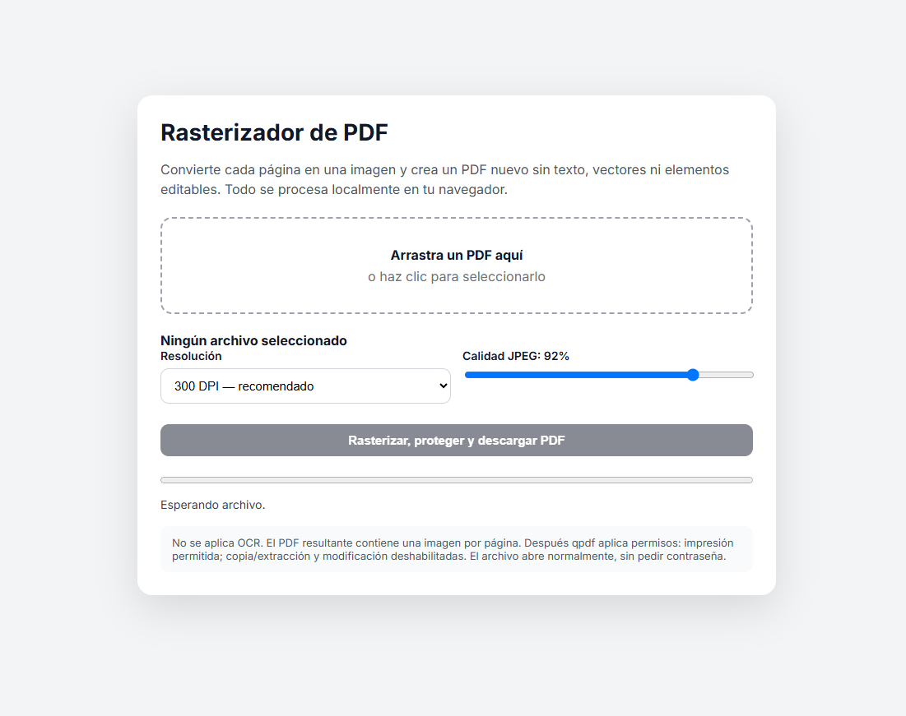

# PDF Protecter

A **privacy-first, client-side PDF hardening tool** built with JavaScript and WebAssembly.

PDF Protecter prepares sensitive documents for external sharing by combining **full-page rasterization** with PDF permission restrictions — entirely in the browser.

<a href="https://fcancinos.github.io/PDFprotecter/" target="_blank">
  Live Demo
</a>


<p align="center">
  
</p>
## What it does

* Rasterizes every PDF page, removing the original text, vectors and editable structure.
* Blocks content copying and extraction.
* Blocks editing, annotations, forms and page modifications.
* Keeps full-quality printing enabled.
* Requires no password to open the resulting PDF.
* Processes documents locally — no PDF upload or backend required.

## How it works

```text
Original PDF
     ↓
PDF.js → Canvas
     ↓
Rasterized pages
     ↓
jsPDF
     ↓
qpdf / WebAssembly
     ↓
Hardened PDF
```

Rasterization acts as the primary protection layer: even if PDF permission flags are bypassed, the original document structure is no longer present.

## Tech Stack

**JavaScript · PDF.js · HTML Canvas · jsPDF · qpdf · WebAssembly**

## Security Scope

PDF Protecter is a **document-hardening tool, not DRM**. Screenshots, OCR and virtual PDF printing are intentionally outside its protection scope.

## Author

**Francisco Cancino**

Built as an exploration of client-side document processing, PDF internals and WebAssembly-based security tooling.
